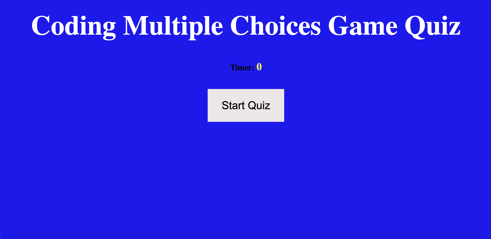
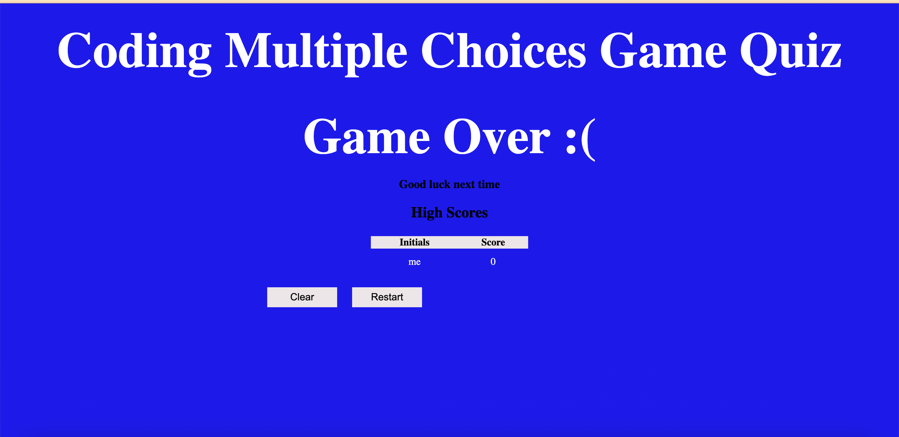

### Discription of the deployed app.

* This project is a multi-choice questions coding quiz. 
* The main purpose of this project app is to allow me to showcase my learned skills using Javascript, Bootsrap, CSS, and HTML. 
* The making of the project does invlove all the main coding tools mentioned above. 
* The project's app runs in the browser and features dynamically updated HTML and CSS powered by the written JavaScript code, which has a polished, clean, and responsive  user interface. 
* The user interface that this project's code is build with, allows the user to land on a page with a title, and a clear heading showing the purpose of the page. 
* The user is able to click the start button to start the quiz and which triggers a timer followed by the first question. 
* Once the user answers the question, another question is presented. if the user answers correctly, the user score builds up. If the user answers incorrectly, the score remains the same, but the timer is subtracted from the clock. Once all the questions are answered, the timer reaches zero and the user is presented with the result and the final score. The result page allows the user to save the result to a local storage by entering the user's initials. Once the initials are entered, the user is able to exit the game or start over. 
### Bellow are the screenshots and the link/URL of the deployed code quiz project app
## Screenshots

## Link/URL to deployed application 
https://lbladma.github.io/JS_Quiz_Project/
